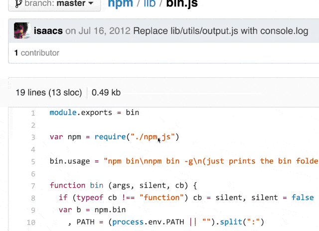

# require-navigator

A Google Chrome extension for navigating Node.js `require()`s in Github.

Clicking on node `require()`s takes you to their Github project page, file, or a Node.js documentation page.

Uses [ghub.io](http://ghub.io) for all npm packages, and [Node docs](http://nodejs.org/api/) for the native modules.

#### Demo

#### Install

Install from [Chrome Web Store](https://chrome.google.com/webstore/detail/github-nodejs-require-nav/ppkcefoejnbdgijdbbpnclfbnnfdfilj) or [get require-navigator.crx](https://github.com/lxe/require-navigator/raw/master/dist/require-navigator.crx)

#### Uninstall

Navigate to `chrome://extensions` and remove Require Navigator.

#### Licesne

MIT

